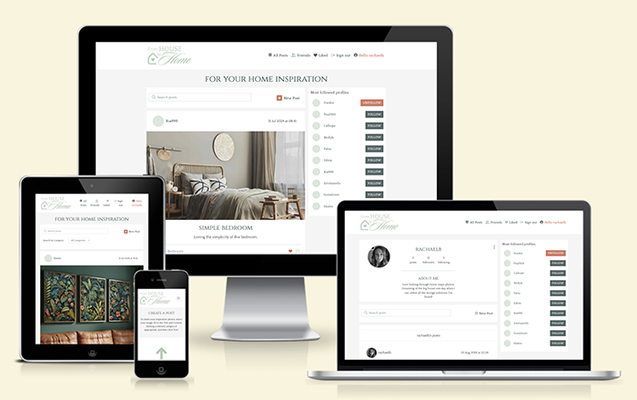
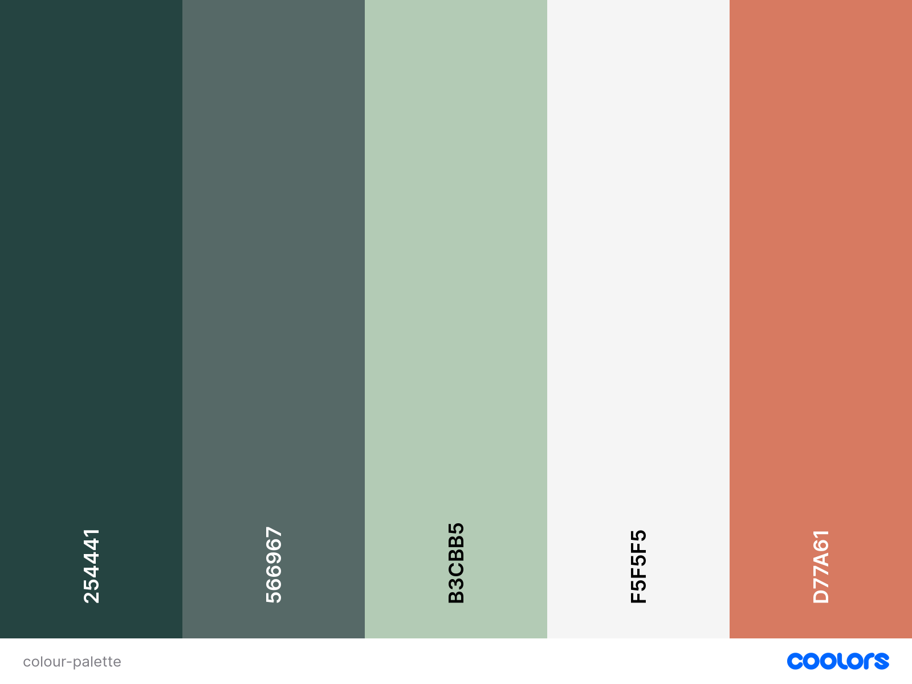
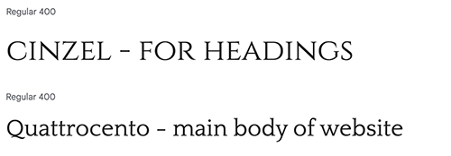

# **FROM HOUSE TO HOME - FRONTEND**

From House to Home is a social plafform designed for visitors to share their inspirational photos with anything to do with the home. The web application has been built with technologies such as React, Bootstrap, and Django to build the backend. The repository for the backend can be found below, which has its own README document. I was inspired to create From House to Home due to my own upcoming house move and felt that any property can be a house, but it takes putting your own stamp on it to become a home.

**LIVE SITE**

[You can view the live web application here.](https://from-house-to-home-b7afcfcc32e9.herokuapp.com/)

**GITHUB PAGES**

[You can view the Front-End GitHub code pages here.](https://github.com/rachaelbabister/from-house-to-home) 
[You can view the API GitHub code pages here.](https://github.com/rachaelbabister/from-house-to-home-api)

---

# **CONTENTS**

<!-- TOC -->

- [**FROM HOUSE TO HOME - FRONTEND**](#from-house-to-home---frontend)
- [**CONTENTS**](#contents)
- [User Experience UX](#user-experience-ux)
    - [Client Goals](#client-goals)
    - [First Time Visitor Goals](#first-time-visitor-goals)
    - [Returning Visitor Goals](#returning-visitor-goals)
    - [Frequent Visitor Goals](#frequent-visitor-goals)
    - [Agile Methodology](#agile-methodology)
- [Design](#design)
    - [Colour Scheme](#colour-scheme)
    - [Typography](#typography)
    - [Wireframes](#wireframes)
        - [Home Page - not logged in](#home-page---not-logged-in)
        - [Home Page - logged in](#home-page---logged-in)
        - [Sign up](#sign-up)
        - [Sign in](#sign-in)
        - [Create Post](#create-post)
        - [Profile page](#profile-page)
        - [Update Profile](#update-profile)
- [Backend Planing](#backend-planing)
    - [Data Models & Relationsips](#data-models--relationsips)
- [Features](#features)
    - [General features](#general-features)

<!-- /TOC -->

---

# User Experience (UX)

## Client Goals

- For users to visit the site and be inspired by others home improvements and design.
- Build a community of like-minded home lovers who enjoy engaging on the platform.
- To encourage visitors not to just scroll through the posts but to add their own as well.
- Thus, being able to easily create a new profile and add posts.
- For visitors to comment on individual posts and start a discussion.
- To be able to 'like' a post and have them saved in their profile.

## First Time Visitor Goals

- Visit the site and immediately know the purpose and navigate easily.
- View a constant feed of posts without having to create an account. 
- Have the ability to search for posts by category to tailor my search.
- Be able to create an account quickly and without too much information required.
- Be able to easily add my own photos and stories.
- Feel welcomed by other users of the site and have the desire to return.

## Returning Visitor Goals

- To be able to come back to the site and not have to log back in, but still have the option to log out if I want to.
- Return to posts I've liked to continue engaging with any comments made.
- Find new ideas from fresh content.
- Follow favourite user profiles so I can personalise my feed.
- Be notified if I have received any interaction with my own posts.
- Add more of my own posts and stories.

## Frequent Visitor Goals

- Be able to continue communicating with other users by way of comments and likes.
- Be able to add or remove likes and follows of posts and profiles to personalise my feed.
- To be able to update or delete my profile.

## Agile Methodology

Before work started on the build of the website, I created a Board of User Stories to determine exactly what was needed. Using the MoSCoW method, it was much easier to implement each issue based on their priority rather than trying to get everything completed. Separate user stories were created for the Front-End from those created for the API, however they were all added to the same project board and separated using a different Epic called Backend. That way the whole development process was visible on the same board. [You can view the user stories on this project board](https://github.com/users/rachaelbabister/projects/4).

---

# Design

## Colour Scheme

The colours chosen for the website were to inspire calm and warmth.

## Typography

Simple and elegant fonts were chosen from Google Fonts, that complimented each other without being too distracting. 

Font Awesome is also used for various icons on the site, in particular on the NavBar.

## Wireframes

Before implementing the website, I created [Wireframes for each page using Balsamiq.

### Home Page - not logged in

### Home Page - logged in

### Sign up

### Sign in

### Create Post

### Profile page

### Update Profile

---

# Backend Planing

## Data Models & Relationsips

[For ease of reference the data models and relationships created for the API are here.](https://github.com/rachaelbabister/from-house-to-home-api?tab=readme-ov-file#data-models)

---

# Features

## General features 

